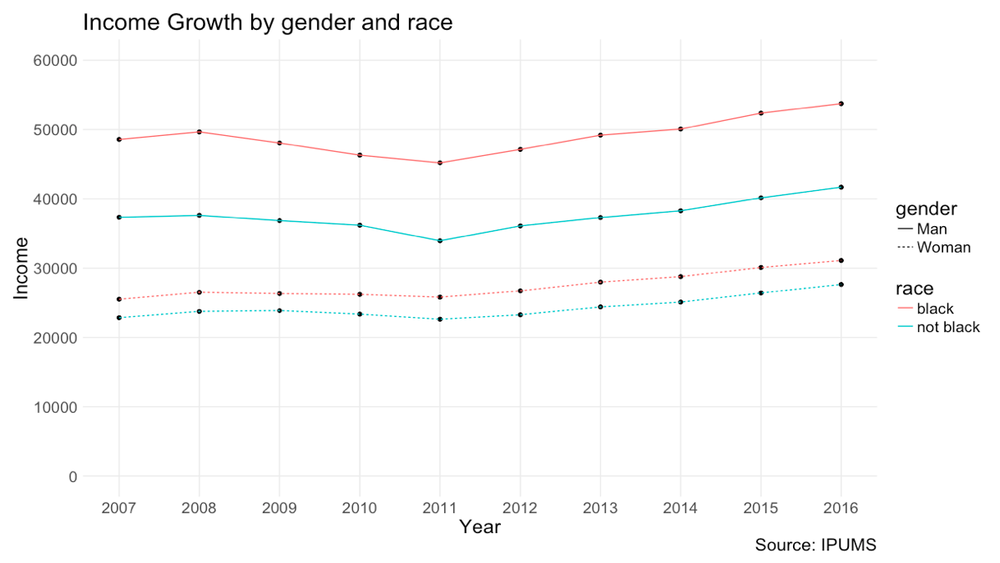
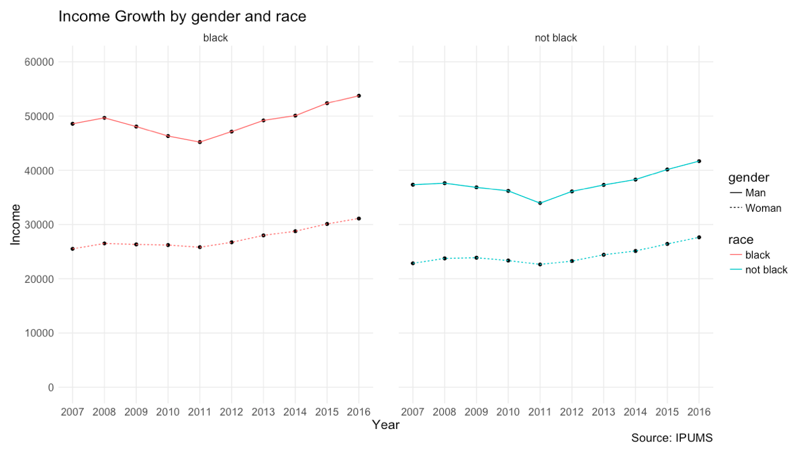

```{r setup, include=FALSE}
knitr::opts_chunk$set(message = FALSE,
                      warning = FALSE,
                      echo = FALSE,
                      cache = TRUE)
library(ggplot2)
library(tidyverse)
library(readstata13)
theme_set(theme_minimal())
```

## Overview
In this work, we try to utilize experiment to test the application of the hierarchy of elementary perceptual, put together by William S. Cleveland and Rober McGill, on the visualization of time-series data. In the hierarchy, graphs with position along common scales enable the most accurate estimates. We extend this idea arguing that for temporal data, which often includes multiple simulateneous time series, the context of the position matters in terms of how accurate and fast readers can extract the information on local comparisons.

## Question and Hypothesis
We want to examine and test the principles of visualization and run task regarding a graphical perception experiment. In this experiment, we aim to answer the question: When data is structured to have multiple groups, is separated line graph (small multiple lines) more efficient in conveying accurate information on within group differences than simple line plot? Our basic assumption is that the number of time series line in a graph has strong effect on the perception performance, thus too many lines in a simple line plot would be distracting. We develop the following hypotheses:

> $H_1$: A separated line graph enables more accurate estimate for within group differences than a simple line graph.

> $H_2$: A separated line graph by categories will take readers less time to make decision in this occasion. 

## Experiment Design
To test this hypothesis, we designed an experiment consisting of one task: estimating the ratio of two data points from a plot. The participants have to read the values of 2 data points (for 1 year) from data, and estimate the percentage of the lower one is to the higher one. To compare the effect of two line graphs has on the participants' ability to accurately estimate and participants' response time, the experiment randomly presents data using one type of line plots.

We first offer a screening question to subjects to avoid unreliable answers. Each subject needs to answer a question, "which group has the highest income value across the years?", to the graph below. The answer should be "Black, Man". If the subject fails this test, the survey will end.



Once the participant passed the screening test, they entered into our random experiment. They will be required to ask the same question for one of the following 2 graphs: In 2014, what percentage does the black women's income take out of black men's income? We asked the subjects to roughly estimate the percentage, and provide the formula to do it in case our question is vague in some ways. 




## Data and Descriptive Analysis
```{r data, echo=FALSE}
survey <- read.csv("surveydata_r.csv")
tot_response <- nrow(dplyr::filter(survey, !grepl("Preview", Status) & !grepl("Spam", Status)))
unfinished_res <- nrow(dplyr::filter(survey, grepl("FALSE", Finished)))
failed_res <- nrow(dplyr::filter(survey, !grepl("Black, Man", Q2)))
response <- dplyr::filter(survey, !grepl("Preview", Status) & !grepl("Spam", Status) & grepl("TRUE", Finished) & grepl("Black, Man", Q2) & !grepl("Not Black, Man", Q2))
linesgroupsize <- nrow(dplyr::filter(response, is.na(Q4_1)==FALSE))
smlsgroupsize <- nrow(dplyr::filter(response, is.na(Q6_1)==FALSE))
percentage <- 57.4563863359794 #true answer to our question, shown in Appendix
```

In total, we received `r tot_response` responses from Amazon Turk in about 72 hours. Among these responses, `r unfinished_res` responses are not finished before we close the survey, and 37 responses failed our screening test. Here we will do our descriptive analyses on our finished responses that passed our screening test, which include `r nrow(response)` observations. Among these observations, `r linesgroupsize` are randomly assigned to answer the question for lines graph, and `r smlsgroupsize` are assigned to small multiple lines group.

We reported the survey answers from these two groups in "Fig: Density of Survey Answers". One can tell that in both groups, most people have an answer value close to the true value. However, the "small multiple lines" group seems to have higher chance to reach the true value according to this preliminary result, which could mean our 1st hypothesis($H_{1}$) is right.

```{r descriptive analysis 1}
response %>% 
  select(Duration..in.seconds., ResponseId, Q4_1, Q6_1) %>%
  mutate("line graph" = Q4_1, "small multiple lines" = Q6_1, timespent = Duration..in.seconds.) %>%
  gather(., key = Graph_Type, value = answer, c("line graph","small multiple lines"), factor_key = TRUE) %>%
  filter(., is.na(answer) == F) %>%
  {.} -> response_long

linesgroup <- filter(response_long, Graph_Type=="line graph")
smlsgroup <- filter(response_long, Graph_Type=="small multiple lines")


response_long %>%
  ggplot(., aes(x=answer, color=Graph_Type)) +
    geom_line(stat="density") +
    geom_vline(xintercept = percentage) +
    scale_x_continuous(breaks = sort(c(seq(0, 100, length.out = 5), round(percentage,1)))) +
    theme_minimal() +
    labs(title = "Density of Survey Answers",
         subtitle = paste0("True Value: ", as.character(percentage))) +
    theme(panel.grid.minor = element_blank())
```

Then let's take a look at the answering speed of participants. It seems that "line graph" has advantage in this scenario, which has more subjects completing the question in less time than average. And in "small multiple lines", there are more subjects taking more than 250 seconds to finish the survey. This preliminary result shows that our 2nd hypothesis($H_{2}$) might be wrong. In next section, we will use methods that are more reliable to test these two hypotheses.

```{r descriptive analysis 2}
avg_timespent <- mean(response_long$timespent)
response_long %>%
  ggplot(., aes(x= timespent, color=Graph_Type)) +
    geom_line(stat="density") +
    geom_vline(xintercept = avg_timespent) +
    scale_x_continuous(breaks = sort(c(seq(0, 750, length.out = 4), round(avg_timespent,1)))) +
    theme_minimal() +
    labs(title = "Density of Answering Speed",
         subtitle = paste0("Average: ", as.character(avg_timespent))) +
    theme(panel.grid.minor = element_blank())
```

## Analysis and Results
### Accuracy

Following the accuracy method from Cleveland and McGill(1984), we decided to measure how the respondent estimates incorrectly using log error accuracy.

The measure that we used is defined as:
  Log error accruacy = $log_{2}(|judged \space estimate - true \space estimate\space value| + \frac{1}{8}$
and large log error accuracy means the estimate is far from true value. 

```{r analysis 1}
acc <- function(jp, tp){
  accr<- log2(abs(jp-tp)+(1/8))
  return (accr)
}

response_long$accr <- sapply(response_long$answer, acc, tp=percentage)

linesgroup <- filter(response_long, Graph_Type=="line graph")
smlsgroup <- filter(response_long, Graph_Type=="small multiple lines")
mean_acc_q4<-mean(linesgroup$accr, na.rm = T)
mean_acc_q6<-mean(smlsgroup$accr, na.rm = T)

accuracy_plot <- response_long %>%
  ggplot(., aes(x=accr, color=Graph_Type)) +
  geom_line(stat = 'density')+
  labs(color = "Graph Type",
       x = "Log Error Accuracy",
       title = "")+
  geom_vline(xintercept=log2(1/8))+
  scale_x_continuous(breaks = sort(c(seq(-4, 10), round(-3,1))))+
  theme_minimal() +
  labs(title = "Density of Log Error Accuracy",
         subtitle = paste0("Accurate Estimate: ", as.character(-3)))+
  theme(panel.grid.minor = element_blank())

#accuracy_plot
c1ac<-cbind('line graph' = mean_acc_q4, 'small multiple lines' = mean_acc_q6)

acctable1 <- as.table(c1ac)
row.names(acctable1) <- c('Mean Log error Accuracy')
acctable1
```

The mean of log error accuracy of two questions are shown in above table. From the table we can observe that the mean of log error accuracy with "small multiple lines"" is higher than that with "line graph" and the difference is 0.0249. From this result, we can conclude that in "small multiple lines", people tend to estimate more accurate than "line graph". 

```{r analysis 2}
accuracy_plot 
```

Now take a look at the density plot of log error accuracy by two graph types. The vertical line in the left side means the case that a estimate is identical with the true value and it is the same value as $log_{2}\frac{1}{8} = -3$. Since the log error accuracy takes the absolute value in the formula, all the results fell into the right side of accurate estimate on the plot. When we compared these two graphs, shapes are similar to each other. But a peak point of "line graph" located on the right side when comparing the graph of "small multiple lines", and "line graph" has larger log error accuracy than "small multiple lines". This indicates that the resondents who assigned to "small multiple lines" tend to estimate more accurate. This result consistent with our hypothesis $H_{1}$.

### Speed

```{r speed}
mean_time <-mean(survey$Duration..in.seconds.)

duration_sv<- filter(response_long, answer >= 47.5 & answer <= 67.5)
linesgroup_sm <- filter(duration_sv, Graph_Type=="line graph")
smlsgroup_sm <- filter(duration_sv, Graph_Type=="small multiple lines")

mean_dur_q4_sm<-mean(linesgroup_sm$Duration..in.seconds., na.rm=TRUE)
mean_dur_q6_sm<-mean(smlsgroup_sm$Duration..in.seconds., na.rm=TRUE)

mean_dur_q4<-mean(linesgroup$Duration..in.seconds., na.rm=TRUE)
mean_dur_q6<-mean(smlsgroup$Duration..in.seconds., na.rm=TRUE)


c1<-cbind('line graph' = mean_dur_q4, 'small multiple lines' = mean_dur_q6)
c2<-cbind('line graph' = mean_dur_q4_sm, 'small multiple lines' = mean_dur_q6_sm)

durable <- as.table(rbind(c1,c2))
row.names(durable) <- c('Mean Duration','Mean Duration within estimate [47.5,67.5]')
durable
```

To test our hypotesis $H_{2}$, we now focus on the duration time to estimate the value with each graph. From the first row of above table, a mean of duration time with "small multiple lines" is a lot larger than a mean of duration time with "line graph" and the difference is about 25 seconds. This indicates that overall, "line graph" took less time to make decision than "small multiple graph".  However, as we observed in the descriptive analysis, there are outliers in duration time, we need to consider outliers to remedy. We decided to focus only on an interval around true estimate value `r percentage`. We arbitrary selected the interval as $\pm 10$ from the true estmate value, $[47.5 , \space 67.5]$. Then we calculated the mean of duration time of each graph type and the result is the second row in the table. These duration times also indicates that the time duration with "small multiple lines" took more time than the time duration with "line graph" and the difference is about 4 seoncds. This result contradicts with our hypothesis $H_{2}$. 

### Accuracy & Speed
```{r analysis 3}
mean_dur_q4_sm_accr<-mean(linesgroup_sm$accr, na.rm=TRUE)
mean_dur_q6_sm_accr<-mean(smlsgroup_sm$accr, na.rm=TRUE)

duration_25<- filter(response_long, Duration..in.seconds. <= 25 )
linesgroup_25 <- filter(duration_25, Graph_Type=="line graph")
smlsgroup_25 <- filter(duration_25, Graph_Type=="small multiple lines")

mean_dur_q4_25_accr<-mean(linesgroup_25$accr, na.rm=TRUE)
mean_dur_q6_25_acct<-mean(smlsgroup_25$accr, na.rm=TRUE)

c1a<-cbind('line graph' = mean_acc_q4, 'small multiple lines' = mean_acc_q6)
c2a<-cbind('line graph' = mean_dur_q4_sm_accr, 'small multiple lines' = mean_dur_q6_sm_accr)
c3a<-cbind('line graph' = mean_dur_q4_25_accr, 'small multiple lines' = mean_dur_q6_25_acct)

acctable <- as.table(rbind(c1a,c2a,c3a))
row.names(acctable) <- c('Mean Log error Accuracy',
                         'Mean Log error Accuracy within estimate [47.5, 67.5]',
                         'Mean Log error Accuracy with duration under 25 sec')
acctable
```

Additionally, we further conducted analysis which considering accuracy and speed at the same time. We made an same criteria as we applied in previous section "Speed" in the second row and calucalted the log error accuracy whithin the interval. The log error accuracy with "line graph" is larger than the log error accuracy with "small muliple lines" within the interval estimate [47.5, 67.5]. This indicates that even within the groups that made a close estimate with the true estimate value, the mean of log error accuracy with "small multiple lines" is smaller than that with "line graph". Thus, the respondents who assigned with "small multiple lines" were able to make more accurate estimate than the respondents who assigned with "line graph". We also made another criteria that the comparison of mean of log error accuracy with the reponsdents who made their decision relatively fast, under 25 seconds. The result is in the third row in the above table, and this also shows that the mean log error accuracy with "small multiple lines" is smaller than that with "line graph". Thus we can conclude that the respondents, who assigned with "small multiple lines" and decided their decision under 25 seconds, were able to make more accurate estimate than the respondents who assigned with "line graph" and decided their decision under 25 seconds. 

## Conclusion
For this experiment, we hypothesized that with multiple time series, all series in one simple line plot would increase the difficulty for subjects to extract the information regarding local comparison, more specifically, within group differences for the data structured with groups. By difficulty, we mainly focused on: (1) the difficulty to extract accurate information; and (2) difficulty to extract information in a short time. Hence our experiment aims to look at the accuracy and answering speed for two randomized groups, exposing to "line graph" and "small multiple lines". The analysis and results seem to consistent wtih our first hypothesis $H_{1}$, a separated line graph enables more accurate estimate for within group differences than a simple line graph. However, the analysis and results seem to contradict with our second hypothesis $H_{2}$,a separated line graph by categories will take readers less time to make decision in this occasion. 

Overall the distribution of estimate by each graph type showed that the result of two graphs are similar each other. To analyze closely, we applied the log error accuracy to measure how the respondent estimate the value incorrectly. The large log error accuracy indicates the estimate is far from true value. The density plot of the log error accuracy and the table with the mean of log error accuracy with each graph type, "line graph" and "small multiple lines", showed that overall the log error accuracy of "small multiple lines" is smaller than that of "line graph". This means that the respondents perform better with "small multiple lines" and thus, "small multiple lines" is less difficult to extract accurate information than "line graph". 
Secondly, we focus on "speed" and difficulty to extract information in a short time. The density plot of duration time and the table with the mean of duration with each graph type clearly showed that "small multiple lines" took more times to make estimate than "line graph". The respondents with "small multiple lines" tended to spend more time to extract information and this may indicate that the "small multiple lines" have difficulty to extract information compared to "line graph".  


## Appendix
```{r sourcedata, echo=T, eval=F}
# This is our data operations for constructing the survey.
# We got our source data from IPUMS.
data = fread("/Users/apple/Dropbox/18spring/dataviz/usa_00002.csv", 
             na.strings=c("0000000", "0000001", "9999999"))
dat = data[, .(avginc = mean(INCTOT, na.rm=TRUE)), by=.(YEAR, SEX, RACE)]

rm(data)

dat = dat[, gender := ifelse(SEX==1, "Man", "Woman")]
dat = dat[, race := ifelse(RACE==1, "black", "not black")]
dat = dat[YEAR!=1970, .(inc = mean(avginc, na.rm=TRUE)), by=.(YEAR, gender, race)]

ggplot(data=as.data.frame(dat), aes(x=YEAR, y=inc)) +
  geom_point() + 
  geom_line(aes(color = race, linetype=gender)) +
  scale_x_continuous(breaks = seq(2007, 2016, 1)) +
  scale_y_continuous(limits = c(0,60000), breaks = seq(0, 60000, 10000)) +
  theme_minimal() +
  labs(title = "Income Growth by gender and race",
       x = "Year",
       y = "Income",
       caption = "Source: IPUMS") +
  theme(panel.grid.minor = element_blank(), text = element_text(size=18))

ggplot(data=as.data.frame(dat), aes(x=YEAR, y=inc)) +
  geom_point() + 
  geom_line(aes(color = race, linetype=gender)) +
  facet_wrap(~ race) +
  scale_x_continuous(breaks = seq(2007, 2016, 1)) +
  scale_y_continuous(limits = c(0,60000), breaks = seq(0, 60000, 10000)) +
  theme_minimal() +
  labs(title = "Income Growth by gender and race",
       x = "Year",
       y = "Income",
       caption = "Source: IPUMS") +
  theme(panel.grid.minor = element_blank(), text = element_text(size=15), panel.spacing = unit(2, "lines"))

# Answer to our main survey question:
percentage = 100 * dat[YEAR==2014 & gender == "Woman" & race == "black", inc] / dat[YEAR==2014 & gender == "Man" & race == "black", inc]
```