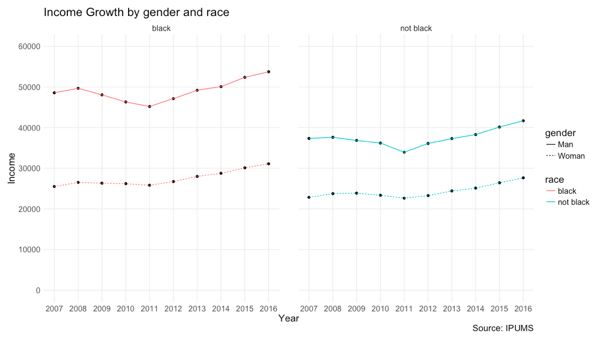

MACS 40700: Assignment 2 - Experiment
================
Alice Mee Seon Chung, Ningyin Xu
5/1/2018

Overview
--------

In this work, we try to utilize experiment to test the application of the hierarchy of elementary perceptual, put together by William S. Cleveland and Rober McGill, on the visualization of time-series data. In the hierarchy, graphs with position along common scales enable the most accurate estimates. We extend this idea arguing that for temporal data, which often includes multiple simulateneous time series, the context of the position matters in terms of how accurate and fast readers can extract the information on local comparisons.

Question and Hypothesis
-----------------------

We want to examine and test the principles of visualization and run task regarding a graphical perception experiment. In this experiment, we aim to answer the question: When data is structured to have multiple groups, is separated line graph (small multiple lines) more efficient in conveying accurate information on within group differences than simple line plot? Our basic assumption is that the number of time series line in a graph has strong effect on the perception performance, thus too many lines in a simple line plot would be distracting. We develop the following hypotheses:

> *H*<sub>1</sub>: A separated line graph enables more accurate estimate for within group differences than a simple line graph.

> *H*<sub>2</sub>: A separated line graph by categories will take readers less time to make decision in this occasion.

Experiment Design
-----------------

To test this hypothesis, we designed an experiment consisting of one task: estimating the ratio of two data points from a plot. The participants have to read the values of 2 data points (for 1 year) from data, and estimate the percentage of the lower one is to the higher one. To compare the effect of two line graphs has on the participants' ability to accurately estimate and participants' response time, the experiment randomly presents data using one type of line plots.

We first offer a screening question to subjects to avoid unreliable answers. Each subject needs to answer a question, "which group has the highest income value across the years?", to the graph below. The answer should be "Black, Man". If the subject fails this test, the survey will end.


Once the participant passed the screening test, they entered into our random experiment. They will be required to ask the same question for one of the following 2 graphs: In 2014, what percentage does the black women's income take out of black men's income? We asked the subjects to roughly estimate the percentage, and provide the formula to do it in case our question is vague in some ways.




Data and Descriptive Analysis
-----------------------------

In total, we received 248 responses from Amazon Turk in about 72 hours. Among these responses, 20 responses are not finished before we close the survey, and 30 responses failed our screening test. Here we will do our descriptive analyses on our finished responses that passed our screening test, which include 191 observations. Among these observations, 88 are randomly assigned to answer the question for lines graph, and 103 are assigned to small multiple lines group.

We report the survey answers from these two groups in "Fig: Density of Survey Answers". One can tell that in both groups, most people have an answer value close to the true value. However, the "small multiple lines" group seems to have higher chance to reach the true value according to this preliminary result, which could mean our 1st hypothesis is right.


Then let's take a look at the answering speed of participants. It seems that "line graph" has advantage in this scenario, which has more subjects completing the question in less time than average. And in "small multiple lines", there are more subjects taking more than 250 seconds to finish the survey. This preliminary result shows that our 2nd hypothesis might be wrong. In next section, we will use methods that are more reliable to test these two hypotheses.


Analysis and Results
--------------------

### Accuracy

### Speed

Conclusion
----------

For this experiment, we hypothesized that with multiple time series, all series in one simple line plot would increase the difficulty for subjects to extract the information regarding local comparison, more specifically, within group differences for the data structured with groups. By difficulty, we mainly focused on: (1) the difficulty to extract accurate information; and (2) difficulty to extract information in a short time. Hence our experiment aims to look at the accuracy and answering speed for two randomized groups, exposing to line graph and "small multiple lines".

Appendix
--------

``` r
# This is our data operations for constructing the survey.
# We got our source data from IPUMS.
data = fread("/Users/apple/Dropbox/18spring/dataviz/usa_00002.csv", 
             na.strings=c("0000000", "0000001", "9999999"))
dat = data[, .(avginc = mean(INCTOT, na.rm=TRUE)), by=.(YEAR, SEX, RACE)]

rm(data)

dat = dat[, gender := ifelse(SEX==1, "Man", "Woman")]
dat = dat[, race := ifelse(RACE==1, "black", "not black")]
dat = dat[YEAR!=1970, .(inc = mean(avginc, na.rm=TRUE)), by=.(YEAR, gender, race)]

ggplot(data=as.data.frame(dat), aes(x=YEAR, y=inc)) +
  geom_point() + 
  geom_line(aes(color = race, linetype=gender)) +
  scale_x_continuous(breaks = seq(2007, 2016, 1)) +
  scale_y_continuous(limits = c(0,60000), breaks = seq(0, 60000, 10000)) +
  theme_minimal() +
  labs(title = "Income Growth by gender and race",
       x = "Year",
       y = "Income",
       caption = "Source: IPUMS") +
  theme(panel.grid.minor = element_blank(), text = element_text(size=18))

ggplot(data=as.data.frame(dat), aes(x=YEAR, y=inc)) +
  geom_point() + 
  geom_line(aes(color = race, linetype=gender)) +
  facet_wrap(~ race) +
  scale_x_continuous(breaks = seq(2007, 2016, 1)) +
  scale_y_continuous(limits = c(0,60000), breaks = seq(0, 60000, 10000)) +
  theme_minimal() +
  labs(title = "Income Growth by gender and race",
       x = "Year",
       y = "Income",
       caption = "Source: IPUMS") +
  theme(panel.grid.minor = element_blank(), text = element_text(size=15), panel.spacing = unit(2, "lines"))

# Answer to our main survey question:
percentage = 100 * dat[YEAR==2014 & gender == "Woman" & race == "black", inc] / dat[YEAR==2014 & gender == "Man" & race == "black", inc]
```
